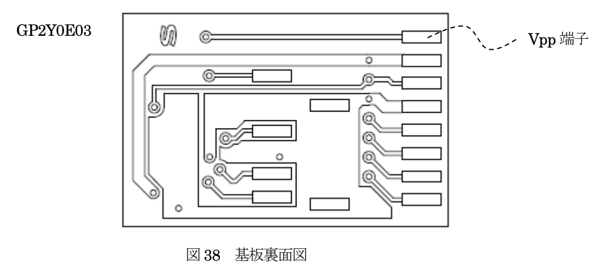
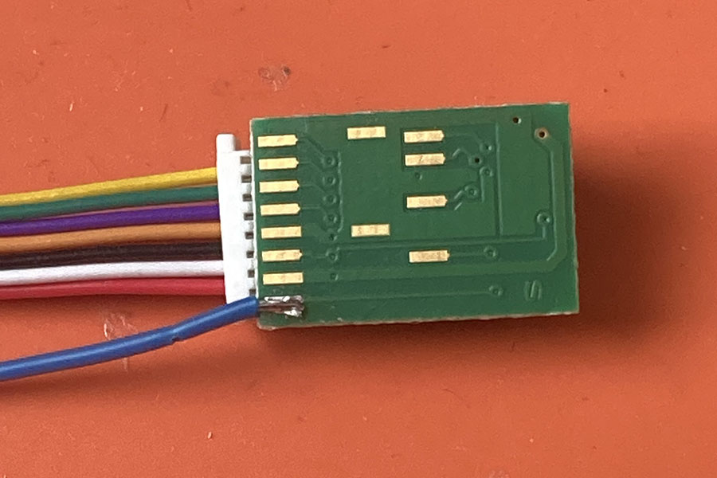
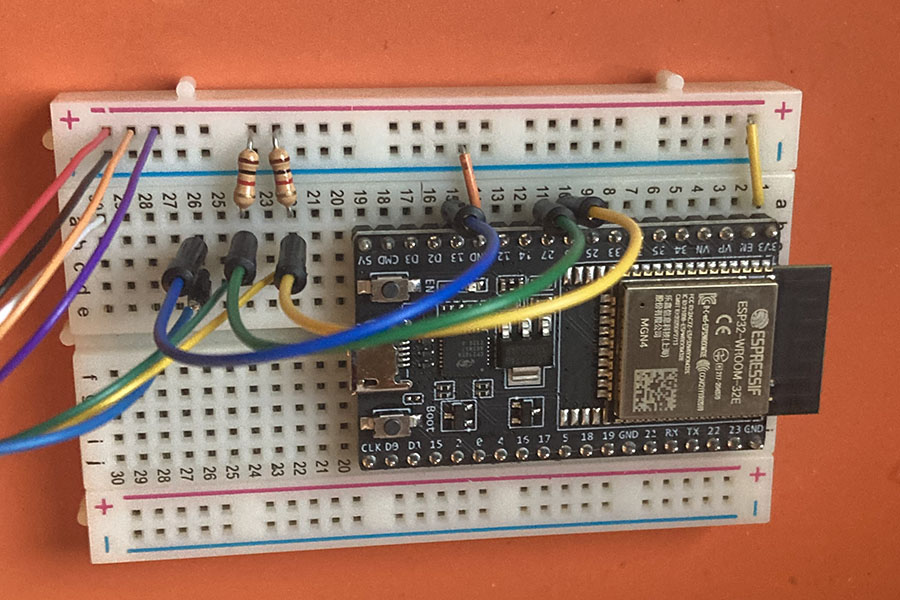

# change_addr_gp2y0e03_i2c
## GP2Y0E03 I2C アドレス書き換えプログラム

# ライセンス
MIT license

# 資料
https://akizukidenshi.com/goodsaffix/GP2Y0E02_an_20180829.pdf

# 注意　
このプログラムはE-Fuseを書き換えます。
1回のみ書き換え可能な不揮発性メモリであるため、実行には気をつけてください。
(失敗した場合は1bitのみ痴漢できる機能があるようです。 資料 12-5 E-Fuse ビット置換 参照)

# 利用方法
## ビルド環境構築
Rust on ESPの環境が必要です。以下のページを参考に環境を構築してください。
https://docs.esp-rs.org/book/

## 配線
GP2Y0E03のE-Fuseに書き込みを行う場合は、Vpp端子に電圧を加える必要があります。
ただし、Vppはケーブルに結線されていないため、裏面のVpp端子に電線をはんだ付けする必要があります。


青い電線をはんだ付けした例


### ブレッドボード配線例
- VDD [赤]
    - 3.3Vに接続
- VIN(IO) [橙]
    - 3.3Vに接続
- GPIO1 [紫]
    - 3.3Vに接続
- GND [黒]
    - GNDに接続。
- Vpp
    - GPIO14番に接続
- SCL [緑]
    - GPIO27番に接続し、1kΩの抵抗を経由して3.3Vに接続する。
- SDA [黄]
    - GPIO26番に接続し、1kΩの抵抗を経由して3.3Vに接続する。



ポートを変更した場合は、プログラム中の以下の箇所を変更してください。
```rust
let i2c_scl = peripherals.pins.gpio27; // SCL Pin
let i2c_sda = peripherals.pins.gpio26; // SDA Pin
let vpp_pin = peripherals.pins.gpio14; // GPIO Write Pin
```

## 設定したいアドレスの指定方法
プログラムの以下定数を設定したい任意の値に書き換えてください。

```rust
// 設定したいデバイスID (要書き換え) > Slave ID : Write
const NEW_WRITE_DEVICE_ID : u8 = 0x20;
```

指定する値は、"資料 表14 スレーブアドレス一覧"の"Writeｻｲｸﾙ”の値となります。
よって、上記のように0x20を指定した場合は、"Readｻｲｸﾙ"は0x21 に、デバイスIDは0x10 (Writeサイクル << 1)となります。

### Writeサイクル・デバイスID早見表

| No | Writeサイクル | デバイスID | デフォルト |
| -- | ------------- | ---------- | ---------- |
| 1  | 0x00          | 0x00       |            |
| 2  | 0x10          | 0x08       |            |
| 3  | 0x20          | 0x10       |            |
| 4  | 0x30          | 0x18       |            |
| 5  | 0x40          | 0x20       |            |
| 6  | 0x50          | 0x28       |            |
| 7  | 0x60          | 0x30       |            |
| 8  | 0x70          | 0x38       |            |
| 9  | 0x80          | 0x40       | O          |
| 10 | 0x90          | 0x48       |            |
| 11 | 0xA0          | 0x50       |            |
| 12 | 0xB0          | 0x58       |            |
| 13 | 0xC0          | 0x60       |            |
| 14 | 0xD0          | 0x68       |            |
| 15 | 0xE0          | 0x70       |            |
| 16 | 0xF0          | 0x78       |            |

## 実行

```sh
$ cargo run
```

NEW_WRITE_DEVICE_IDに 0x40 を指定し、実行に成功した場合は以下のように新しいデバイスIDが出力がされます。
```
I (3521) change_addr_gp2y0e03_i2c: Result > I2C Device Id : 0x10, Write Id: 0x20

```

# プログラム説明
"資料 表20 各種設定項目のE-Fuse 設定値一覧" の(1)の内容を逐次実行しています。
Stage5の直後で、500μsの待機を入れる必要があります。

